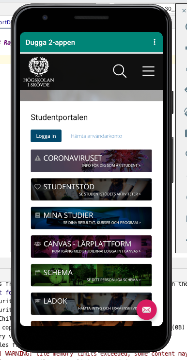

# Rapport dugga 2

Först forkades och cloneades den tilldelade webviewen från Github till den egna repositoryn. 
Därefter öppnades den i Adroid Studio. 
I Res-mappen under values/string byttes namnet på appen.
```
<resources>
    <string name="app_name">Dugga 2-appen</string>
```

För att få tillåtelse till Internet lades nedan kod till i AndroidManifests xml-fil.
```
    <package="com.example.webviewapp">
    <uses-permission android:name="android.permission.INTERNET"/>
    <application>
```

Sedan ändrades TextView-elementet till ett WebView-element i filen content_main.xml. Margin top 
lades till för att inte "täckas" utan hamna under toolbaren. WebViewen tilldelades också ett ID.
```
<WebView
        android:id="@+id/my_webview"
        android:layout_width="match_parent"
        android:layout_height="match_parent"
        android:layout_marginTop="60dp"
        />
```

I MainActivity-filen där all java-kod med metoder och functioner ligger deklarerades en privat variabel
med namnet myWebView och i onCreate skapades länken till WebView med findViewById. Där aktiviverades
också javascript.
```
       myWebView = (WebView) findViewById(R.id.my_webview);
       myWebView.getSettings().setJavaScriptEnabled(true);
```
Efter det lades en Assets-mapp till där ett enkel html-webbsida lades till. Sedan länkades till en
extern webbsida i detta fall studentsidan på högskolan och den interna webbsidan länkades också till
med loadUr. Sedan kallades de längst ner i java-koden i action_external och action_internal.
```
    public void showExternalWebPage(){myWebView.loadUrl("https://student.his.se/");}
    public void showInternalWebPage(){ myWebView.loadUrl("file:///android_asset/about.html"); }

```

Screenshots till de olika vyerna ligger som 




